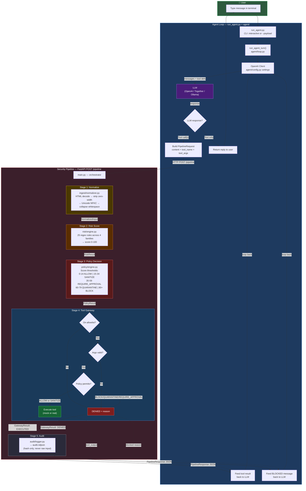
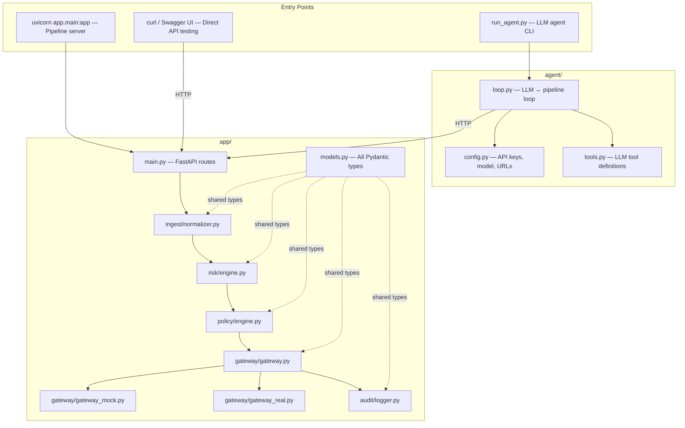

# Agentic Security Pipeline — Architecture Flow

## Full System Flow

## Data Model Chain

```mermaid
flowchart LR
    PR["PipelineRequest<br/><i>content, source_type,<br/>proposed_tool, tool_args</i>"]
    NI["NormalizedInput<br/><i>normalized_content,<br/>normalization_notes</i>"]
    RR["RiskResult<br/><i>risk_score, risk_categories,<br/>matched_signals, rationale</i>"]
    PLR["PolicyResult<br/><i>policy_action, policy_reason,<br/>requires_approval</i>"]
    GR["GatewayResult<br/><i>gateway_decision,<br/>decision_reason, tool_output</i>"]
    RESP["PipelineResponse<br/><i>wraps all above +<br/>timestamp + summary</i>"]

    PR -->|"normalizer.normalize()"| NI
    NI -->|"risk_engine.score()"| RR
    RR -->|"policy_engine.decide()"| PLR
    PLR -->|"gateway.mediate()"| GR
    GR --> RESP
    PR -.->|"also passed to gateway"| GR

    style PR fill:#1e3a5f,stroke:#60a5fa,color:#fff
    style NI fill:#4a3800,stroke:#fbbf24,color:#fff
    style RR fill:#5a2d00,stroke:#fb923c,color:#fff
    style PLR fill:#5a1a1a,stroke:#f87171,color:#fff
    style GR fill:#1a3a5a,stroke:#60a5fa,color:#fff
    style RESP fill:#166534,stroke:#4ade80,color:#fff
```

## File Map

> **To render:** Open this file in GitHub, VS Code with a Mermaid extension, or paste the code blocks into [mermaid.live](https://mermaid.live).
